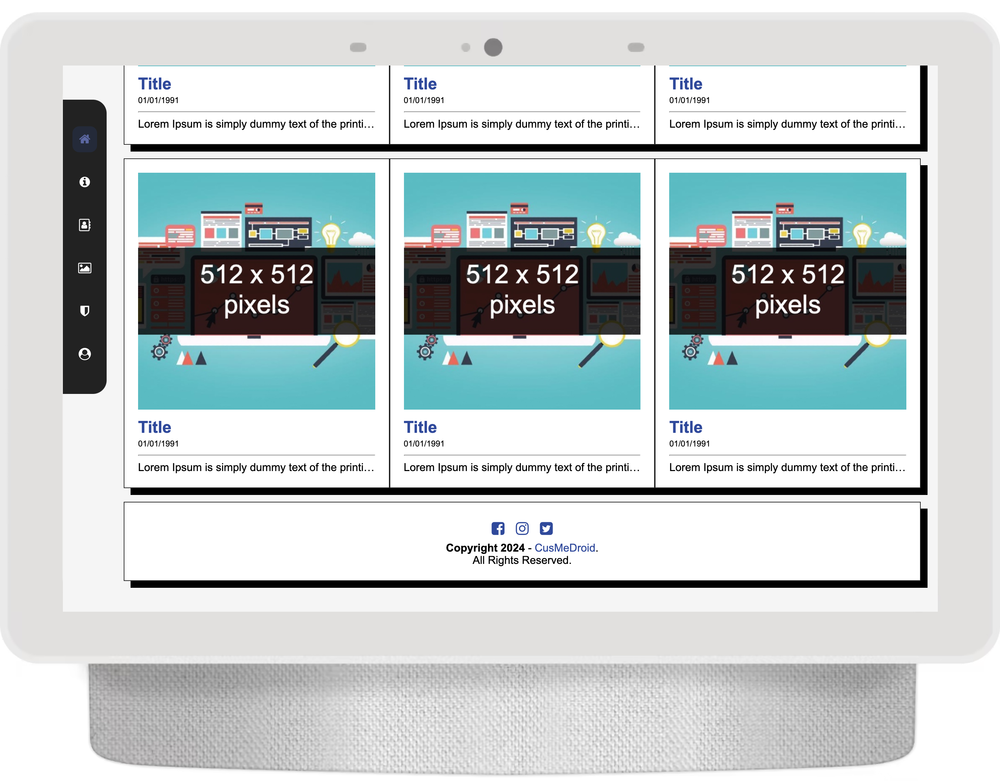

Hot News Template is a template with a contemporary elegant appearance with minimal UI/UX, using icons from fontawesome version 4.

# Logo
[](favicon.ico)

# Meta
``` txt
 ------ Home
|      |
|       ------ All post
|
 ------ About
|      |
|       ------ What's the web
|
 ------ Contact
|      |
|       ------ Send message by email
|
 ------ Gallery
|      |
|       ------ All photos basic (w3schools)
|
 ------ Privacy Policies
|      |
|       ------ Consent the site
|
 ------ Account
       |
        ------ Your profile and settings
```

# Screenshot Tablet/PC
[](assets/screenshot/tb001.png) [](assets/screenshot/tb002.png) [](assets/screenshot/tb003.png) [](assets/screenshot/tb004.png) [](assets/screenshot/tb005.png) [](assets/screenshot/tb006.png) [](assets/screenshot/tb007.png) [](assets/screenshot/tb008.png) [](assets/screenshot/tb009.png)

# Screenshot Mobile
[](assets/screenshot/m001.png) [](assets/screenshot/m002.png) [](assets/screenshot/m003.png) [](assets/screenshot/m004.png) [](assets/screenshot/m005.png) [](assets/screenshot/m006.png) [](assets/screenshot/m007.png) [](assets/screenshot/m008.png) [](assets/screenshot/m009.png)

# Clone
Select your directory location
```
$ cd '/c/Users/YOUR USERNAME HERE/ 'My Project'
```

Download git
```
git clone https://github.com/CusMeDroid/hotnewstemplate.git
```
# Donate
[](https://paypal.me/iyortml)
